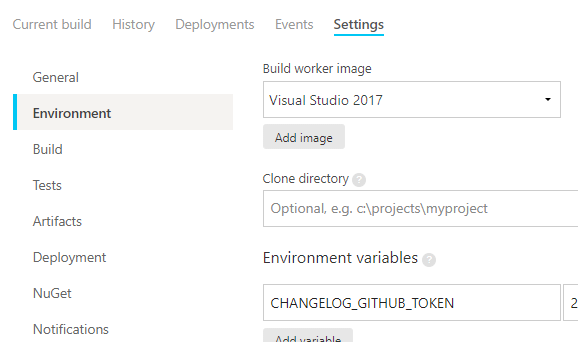

# changelog-sakura

sakura-editor/sakura の ```CHANGELOG.md``` を生成します。

- ```AppVeyor``` で ```github_changelog_generator``` を実行し、生成します。

- 実行結果は https://ci.appveyor.com/project/HiroakiTAKEUCHI/changelog-sakura 参照

- そのままだと github の API レートリミットにすぐ到達してしまうため、トークンを指定しておく必要があります。
  - AppVeyor 側の ```Environment variables``` に ```CHANGELOG_GITHUB_TOKEN``` として ```public_repo``` を許可したトークンを設定しておきます。
  
   
